# User Flow Diagrams

Visual flow diagrams for key user journeys in the Instagram UGC Platform.

## Flow 1: Discover and Save Content

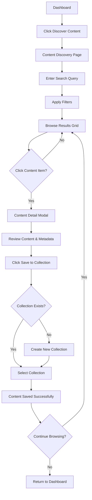

## Flow 2: Request Permission

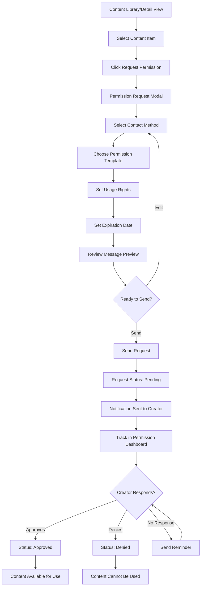

## Flow 3: Export Content

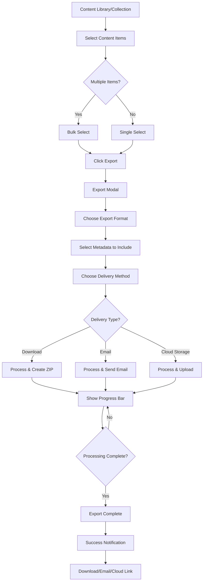

## Flow 4: Content Organization

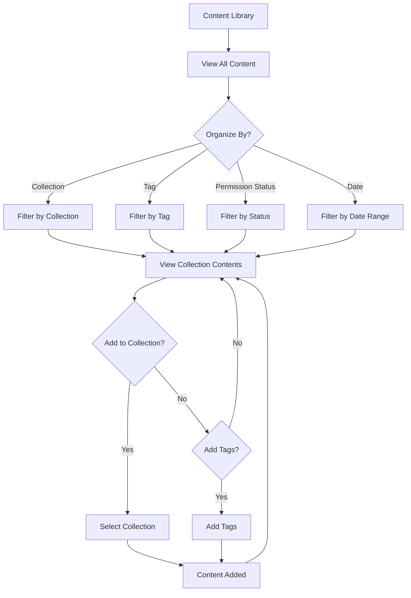

## Flow 5: Permission Management Workflow

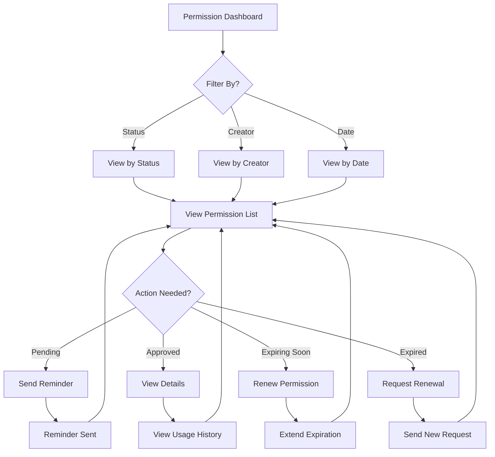

## Flow 6: User Onboarding

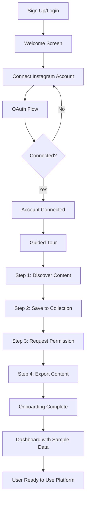

## Flow 7: Content Search and Filter

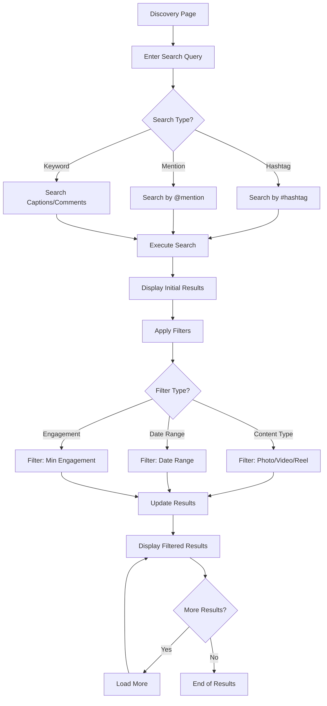

## Flow 8: Collection Management

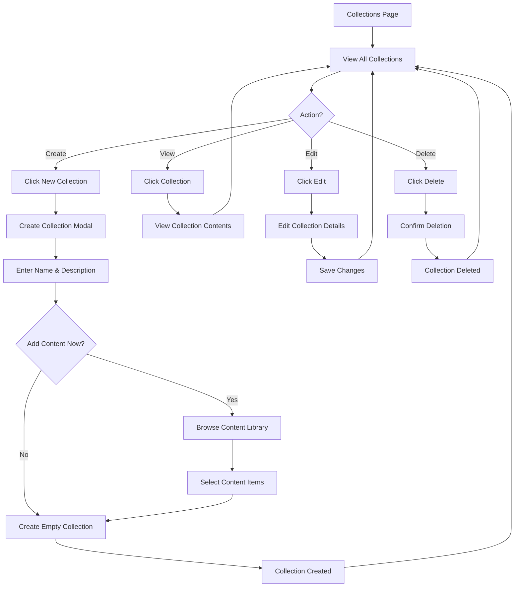

## Flow 9: Content Usage Tracking

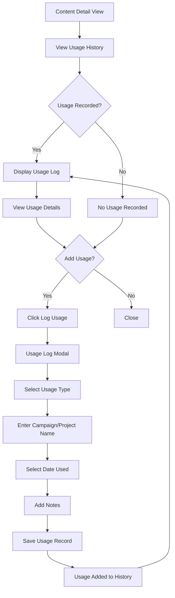

## Flow 10: Error Handling

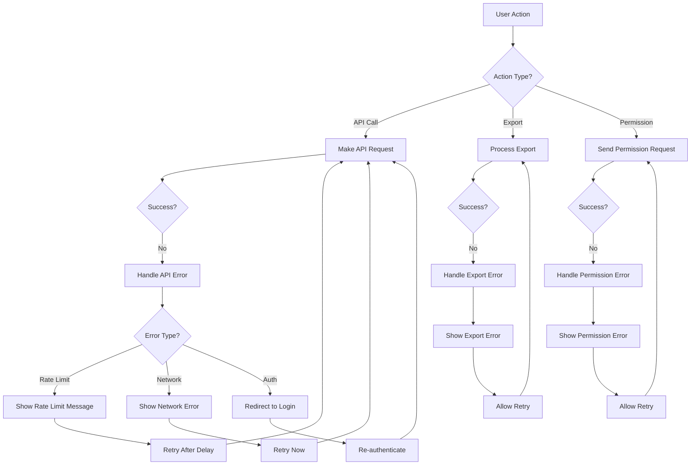

## Component Interaction Diagram

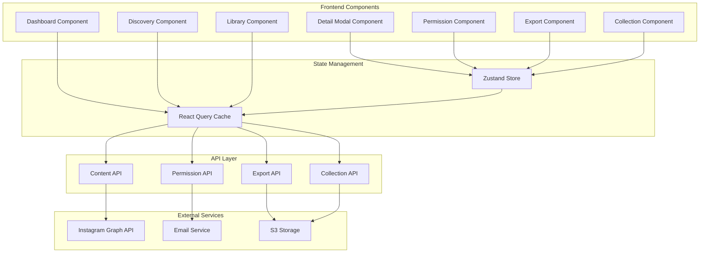

## Data Flow Diagram

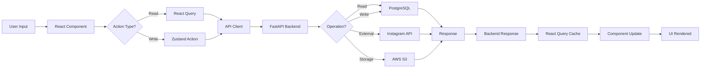

